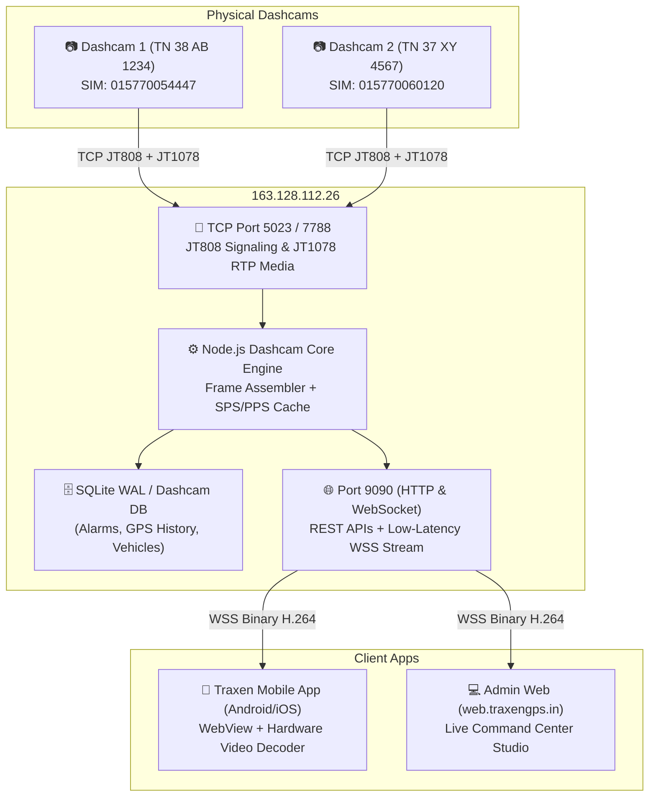
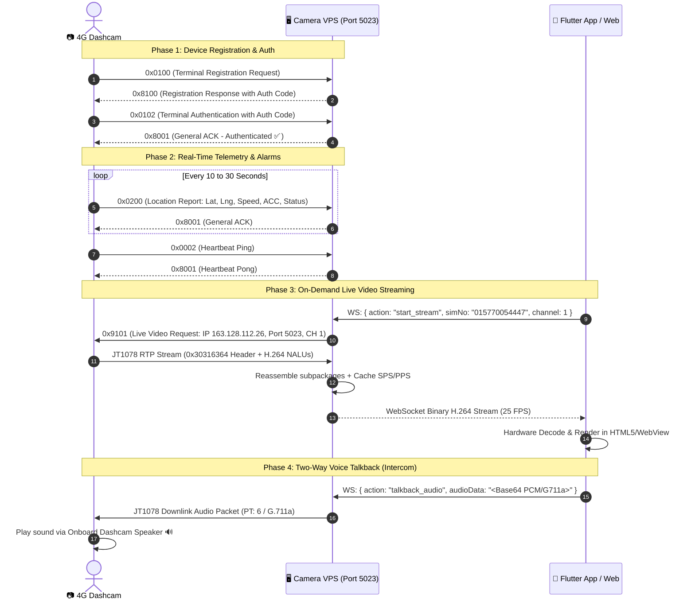

# 🚗 TRAXEN DASHCAM — FULL BACKEND & APP INTEGRATION DEVELOPER HANDBOOK

> **Target Audience**: Backend Engineers, Mobile App Developers, DevOps & System Architects  
> **System Scope**: T98 4G Dual-Cam Dashcam Integration via JT/T 808 (Signaling & GPS) & JT/T 1078 (Audio/Video Media)  
> **Repository References**:
> - **Camera VPS Backend**: [dashcam.git](https://github.com/sathissk12-gif/dashcam.git)
> - **Flutter Mobile & Web App**: [admin_traxen.git](https://github.com/sathissk12-gif/admin_traxen.git) / [traxen_app.git](https://github.com/sathissk12-gif/traxen_app.git)

---

## 1. System Architecture Overview (Dual-VPS Isolation)

Traxen operates on a strict **Dual-VPS Architecture** to guarantee that high-bandwidth video streaming does not degrade or interfere with primary fleet tracking, billing, or telemetry operations.



---

## 2. What the Backend Environment Requires

### 2.1 Server Specifications (Camera VPS)
* **OS**: Ubuntu 22.04 LTS or 24.04 LTS (x86_64)
* **Runtime**: Node.js v18+ / v20+ LTS
* **Process Manager**: PM2 (`npm install -g pm2`)
* **Database**: SQLite3 with **WAL mode enabled** (`better-sqlite3`)
* **Public IP**: `163.128.112.26`

### 2.2 Network Ports Configuration (Firewall / UFW Rules)
| Port | Protocol | Purpose | Access Level |
| :--- | :--- | :--- | :--- |
| **`5023`** | TCP | Primary JT808 Signaling + JT1078 Video Media Gateway | Public (Dashcams) |
| **`7788`** | TCP | Secondary / Alternate JT808 Gateway Port | Public (Dashcams) |
| **`9090`** | TCP | HTTP REST APIs + WebSocket Video/Telemetry Server | Public (App/Web/Admins) |
| **`80 / 443`** | TCP | Optional Nginx Reverse Proxy with SSL (`dashcam.traxengps.in`) | Public |

```bash
# Ubuntu UFW Firewall Commands:
sudo ufw allow 5023/tcp
sudo ufw allow 7788/tcp
sudo ufw allow 9090/tcp
sudo ufw reload
```

---

## 3. How Data is Received from the Physical 4G Dashcam

The camera communicates with the backend over persistent TCP connections using Chinese Ministry of Transport protocols (**JT/T 808-2019** for telemetry/commands and **JT/T 1078-2016** for audio/video).

### 3.1 Packet Frame Structure

```
JT/T 808 Standard Packet:
[0x7E] [MsgID (2B)] [BodyAttr (2B)] [SIM BCD (6B)] [SeqNo (2B)] [Body (NB)] [XOR Checksum (1B)] [0x7E]

JT/T 1078 Video RTP Stream Packet:
[0x30 0x31 0x63 0x64] [SIM BCD (6B)] [Seq (2B)] [PT & Subpackage (1B)] [Timestamp (8B)] [Payload Length (2B)] [H.264 NALU Data]
```

---

### 3.2 Complete Connection Lifecycle Flow



---

## 4. Video Stream Processing & Frame Assembler Engine

### 4.1 Subpackage Frame Assembly
Dashcams split large H.264 I-Frames (Keyframes) across multiple RTP packets:
* `subpackage = 1`: First chunk
* `subpackage = 2`: Intermediate chunk
* `subpackage = 3`: Concluding chunk
* `subpackage = 0`: Atomic unfragmented frame

The backend frame assembler buffers chunks keyed by `${simNo}_${channel}` and emits the complete frame once `subpackage = 3` arrives. If a packet is delayed > 400ms, stale buffers are purged to prevent memory leaks and frame artifacts.

### 4.2 SPS/PPS Caching for Instant Playback
When a user opens the video stream, waiting for the camera's next natural keyframe interval (1 to 2 seconds) causes a black screen delay.  
* **Backend Solution**: The backend caches the latest **SPS (Sequence Parameter Set)** and **PPS (Picture Parameter Set)** NALUs.
* As soon as a WebSocket client requests a stream, the backend immediately sends the cached SPS/PPS header so the browser decoder initializes within **< 100 milliseconds**!

### 4.3 Smooth Dynamic Catch-Up (Anti-Stutter)
Instead of aggressive `currentTime` micro-seeking (which drops keyframes and causes stutter):
* Lag `< 0.15s`: Normal `1.0x` speed
* Lag `0.4s - 2.0s`: Dynamic `1.15x` catch-up speed (silently drains buffer lag)
* Lag `> 2.0s`: Hard seek to buffer edge

---

## 5. REST & WebSocket API Contract for Developers

### 5.1 REST API Endpoints (Base URL: `http://163.128.112.26:9090`)

#### 1. Fetch Fleet Dashcams
```http
GET /api/vehicles HTTP/1.1
Authorization: Bearer <JWT_TOKEN>
```
**Response (200 OK):**
```json
{
  "success": true,
  "data": [
    {
      "id": "veh_015770054447",
      "numberPlate": "TN 38 AB 1234",
      "simNo": "015770054447",
      "model": "T98 NON-AI 4G Dual-Cam",
      "driverName": "Driver 1",
      "driverPhone": "+91 98765 43210",
      "channelCount": 2,
      "isOnline": true,
      "telemetry": {
        "latitude": 11.295318,
        "longitude": 77.737556,
        "speed": 34.5,
        "acc": true,
        "address": "Coimbatore, Tamil Nadu"
      }
    }
  ]
}
```

#### 2. Start Live Stream Signal
```http
POST /api/vehicles/015770054447/stream/start HTTP/1.1
Content-Type: application/json

{
  "channel": 1,
  "streamType": 1
}
```

#### 3. Stop Live Stream Signal
```http
POST /api/vehicles/015770054447/stream/stop HTTP/1.1
Content-Type: application/json

{
  "channel": 1
}
```

#### 4. Query SD Card Recorded Chunks (`0x9205`)
```http
GET /api/vehicles/015770054447/playback/records?channel=1&startTime=2026-08-29T00:00:00Z&endTime=2026-08-29T23:59:59Z HTTP/1.1
```

#### 5. Start SD Card Remote Playback (`0x9201`)
```http
POST /api/vehicles/015770054447/playback/start HTTP/1.1
Content-Type: application/json

{
  "channel": 1,
  "startTime": "2026-08-29T08:00:00Z",
  "endTime": "2026-08-29T08:30:00Z",
  "mode": 0,
  "speed": 1
}
```

---

### 5.2 WebSocket Real-Time Interface (`ws://163.128.112.26:9090/ws?viewer=true`)

#### Actions Sent by Client:
1. **Start Live Stream**:
   ```json
   {
     "action": "start_stream",
     "simNo": "015770054447",
     "channel": 1,
     "streamType": 1,
     "mediaPort": 5023
   }
   ```
2. **Stop Stream**:
   ```json
   {
     "action": "stop_stream",
     "simNo": "015770054447",
     "channel": 1
   }
   ```
3. **Transmit Audio Talkback (Mic to Dashcam Speaker)**:
   ```json
   {
     "action": "talkback_audio",
     "simNo": "015770054447",
     "channel": 1,
     "audioData": "<Base64 Encoded PCM / G.711a Data>"
   }
   ```

#### Messages Received from Server:
* **Binary Messages**: Raw H.264 Annex-B Video Frames fed directly to JMuxer.
* **JSON Messages**:
  * `type: "stream_started"`
  * `type: "device_list"`
  * `type: "device_location"`
  * `type: "device_alarm"`

---

## 6. Dashcam SMS Configuration Reference (For New Cameras)

Depending on your dashcam firmware manufacturer variant, use either **Format A (Concox / Standard JT808 - Most Common)** or **Format B**:

### 🌟 Format A: Standard JT808 / Concox / Jimi Format (Recommended)
Send these SMS messages from any phone to the camera's SIM number:
```text
1. Set APN (Internet Access):
   APN,airtelgprs.com#      (For Airtel)
   APN,jionet#              (For Jio)
   APN,portalnmms#          (For Vodafone/Vi)

2. Point to Camera VPS (Port 5023):
   SERVER,1,163.128.112.26,5023,0#

3. Set Telemetry & Heartbeat Interval (30s):
   TIMER,30#

4. Restart Dashcam to Apply Changes:
   RESET#

5. Check Live Camera Status:
   PARAM#   or   STATUS#
```

---

### 🔹 Format B: Alternate Hash Format
```text
1. Set IP and Port:
   IP#163.128.112.26#5023#

2. Set APN:
   APN#airtelgprs.com#

3. Reboot:
   REBOOT#
```

---

### 🔹 Format C: T98 OEM Specific Prefix Format
```text
*98*#APN,airtelgprs.com#
*98*#SERVER,163.128.112.26,5023#
*98*#VIDEOSERVER,163.128.112.26,5023#
*98*#INTERVAL,30#
*98*#RESET#
```

---

## 7. Developer Quick Verification Checklist

- [x] **JT808 Signaling Port 5023**: Active and accepting incoming camera TCP sockets.
- [x] **JT1078 Video Ingestion Port 5023**: RTP video packets assembled and parsed into H.264 NALUs.
- [x] **Web & Mobile Streaming Port 9090**: HTTP REST APIs + WebSocket binary stream broadcaster.
- [x] **CORS Whitelist**: `https://web.traxengps.in`, `https://traxengps.in`, `https://api.traxengps.in` with credentials enabled.
- [x] **Flutter Android Cleartext Traffic**: `android:usesCleartextTraffic="true"` configured.
- [x] **Mobile Permissions**: `INTERNET`, `RECORD_AUDIO`, `ACCESS_NETWORK_STATE` enabled in `AndroidManifest.xml`.
- [x] **Dynamic Base URL**: Set to `http://163.128.112.26:9090` across all API services.
