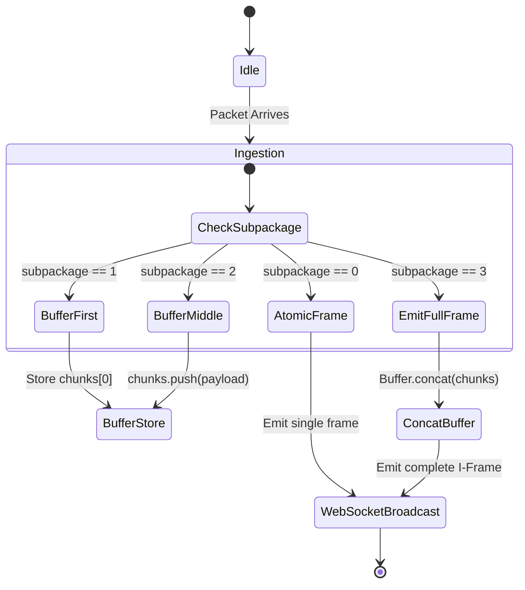

# 🛰️ TRAXEN DASHCAM — PROTOCOL SPECIFICATION & BYTE-BY-BYTE DECODING MASTER HANDBOOK

> **Document Type**: Hardware Protocol & Communication Engineering Specification  
> **Protocols Covered**: 
> - **JT/T 808-2019**: GPS, Telemetry, Alarms & Control Signaling Gateway  
> - **JT/T 1078-2016**: Real-Time Audio/Video RTP Media Streaming & SD Playback Gateway  
> - **BSJ Protocol**: T98 Dashcam SMS Over-The-Air Provisioning Commands  
> **Target Devices**: T98 4G Dual-Camera Dashcam & JT808/JT1078 Compliant Dashcams  

---

## 1. Device Provisioning via BSJ SMS Protocol

Before any data is received by the backend, the 4G Dashcam must be provisioned over SMS to connect to the Camera VPS (`163.128.112.26`).

### 📲 Required SMS Commands (Send to Camera SIM Card):

```text
1️⃣ Primary Server IP & Signaling Gateway (Port 5023):
   <SPBSJ*P:BSJGPS*D:163.128.112.26,5023>
   Response from Dashcam: <BSJ*...*T:163.128.112.26,5023*...>

2️⃣ Live Video Media Streaming Gateway (Port 5023):
   <SPBSJ*P:BSJGPS*G:163.128.112.26:5023>
   Response from Dashcam: <BSJ*...*G:163.128.112.26:5023*...>

3️⃣ APN Internet Configuration:
   <SPBSJ*P:BSJGPS*A:airtelgprs.com>   (Airtel)
   <SPBSJ*P:BSJGPS*A:jionet>           (Jio)
   <SPBSJ*P:BSJGPS*A:portalnmms>       (Vodafone/Vi)

4️⃣ Force ACC ON & Disable Deep Sleep (Continuous Stream Ready):
   <SPBSJ*P:BSJGPS*ACC:1>
   <SPBSJ*P:BSJGPS*SLEEP:0>

5️⃣ Live Status & Parameter Query:
   <SPBSJ*P:BSJGPS*Q>
```

---

## 2. Low-Level Transport & Framing Rules (JT/T 808)

All JT808 communication operates over persistent **TCP sockets** on Port `5023`.

### 2.1 Packet Frame Structure

```
+--------+---------------+---------------+---------------+---------------+---------------+---------------+--------+
| 0x7E   | Msg ID (2B)   | Body Attr(2B) | SIM BCD (6B)  | Seq No (2B)   | Body (N Bytes)| Checksum (1B) | 0x7E   |
+--------+---------------+---------------+---------------+---------------+---------------+---------------+--------+
```

| Field | Size | Description |
| :--- | :--- | :--- |
| **Start Flag** | 1 Byte | Always `0x7E` |
| **Message ID** | 2 Bytes | Hex command ID (e.g., `0x0100`, `0x0200`, `0x9101`) (Big-Endian UInt16) |
| **Body Attributes** | 2 Bytes | Bits 0-9: Message Body Length $N$<br/>Bits 10-12: Data Encryption (0=None, 1=RSA)<br/>Bit 13: Subpackaging flag (0=Single, 1=Multi) |
| **Terminal Phone No (SIM)**| 6 Bytes | 12-digit BCD format (e.g., `01 57 70 05 44 47` = `"015770054447"`) |
| **Message Serial No** | 2 Bytes | Auto-incrementing sequence number (Big-Endian UInt16) |
| **Message Body** | $N$ Bytes | Specific payload defined by Message ID |
| **Checksum (XOR)** | 1 Byte | XOR calculation from Message ID up to the last byte of Body |
| **End Flag** | 1 Byte | Always `0x7E` |

---

### 2.2 Escape / Unescape Rules (Octet Stuffing)
To prevent payload bytes from colliding with delimiter `0x7E`:
* **Before Sending (Escape)**:
  * `0x7E` $\rightarrow$ `0x7D 0x02`
  * `0x7D` $\rightarrow$ `0x7D 0x01`
* **After Receiving (Unescape)**:
  * `0x7D 0x02` $\rightarrow$ `0x7E`
  * `0x7D 0x01` $\rightarrow$ `0x7D`

### 2.3 XOR Checksum Formula
```javascript
function calculateChecksum(buffer) {
  let checksum = 0;
  for (let i = 0; i < buffer.length; i++) {
    checksum ^= buffer[i];
  }
  return checksum;
}
```

---

## 3. Byte-by-Byte JT/T 808 Message Specifications

### 3.1 Terminal Registration (`0x0100` $\rightarrow$ `0x8100`)

When the dashcam boots and connects to TCP Port 5023, it sends `0x0100`.

#### Upstream Payload (`0x0100` from Dashcam):
| Offset | Field | Type | Size | Example / Description |
| :--- | :--- | :--- | :--- | :--- |
| `0` | Province ID | UInt16BE | 2 Bytes | `0x002C` (Tamil Nadu) |
| `2` | City ID | UInt16BE | 2 Bytes | `0x0104` (Coimbatore) |
| `4` | Manufacturer ID | ASCII | 5 Bytes | `"BSJ01"` |
| `9` | Terminal Model | ASCII | 20 Bytes | `"T98-4G-DUALCAM     "` |
| `29` | Terminal ID | ASCII | 7 Bytes | `"5444701"` |
| `36` | License Plate Color | UInt8 | 1 Byte | `1` (Blue), `2` (Yellow), `0` (None) |
| `37` | Vehicle Plate String | GBK / ASCII | $N$ Bytes | `"TN 38 AB 1234"` |

#### Downstream Server Response (`0x8100` from VPS):
```
[0x7E] [0x8100] [Attr: 11B] [SIM BCD] [ServerSeq] [RespSeq (2B)] [Result (1B)] [AuthCode (8B)] [Checksum] [0x7E]
```
* **Result Byte**: `0` = Success, `1` = Vehicle already registered, `2` = Vehicle not found, `3` = Terminal registered.
* **Auth Code**: Generated authentication string e.g., `"AUTH_054447"`.

---

### 3.2 Terminal Authentication (`0x0102` $\rightarrow$ `0x8001`)

#### Upstream Payload (`0x0102` from Dashcam):
| Offset | Field | Type | Size | Description |
| :--- | :--- | :--- | :--- | :--- |
| `0` | Auth Code | String (ASCII) | $N$ Bytes | Auth string returned in `0x8100` |

#### Downstream Response (`0x8001` General ACK):
* Body: `[AckSeqNo (2B)] [AckMsgId (2B: 0x0102)] [Result (1B: 0=Success)]`

---

### 3.3 Heartbeat Ping (`0x0002` $\rightarrow$ `0x8001`)
* Sent every 30 seconds to maintain TCP keep-alive.
* Body length is 0. Server responds with `0x8001` ACK.

---

### 3.4 Real-Time Location & Telemetry Report (`0x0200`)

Sent periodically (every 10s–30s) or triggered by events.

```
+-------------------------------------------------------------------------------+
| Alarm (4B) | Status (4B) | Lat (4B) | Lng (4B) | Alt (2B) | Spd (2B) | Crs (2B)| Time (6B) |
+-------------------------------------------------------------------------------+
```

#### Byte Layout (28 Bytes Standard Body):
| Offset | Field | Type | Size | Unit / Decoding Formula |
| :--- | :--- | :--- | :--- | :--- |
| `0` | **Alarm Mask** | UInt32BE | 4 Bytes | Bitmask flags (SOS, Overspeed, Impact, etc.) |
| `4` | **Status Mask** | UInt32BE | 4 Bytes | Bitmask flags (ACC, GPS Fixed, Lat/Lng sign) |
| `8` | **Latitude** | UInt32BE | 4 Bytes | **`Lat = raw / 1,000,000`** (e.g. `11295318` $\rightarrow$ `11.295318° N`) |
| `12` | **Longitude** | UInt32BE | 4 Bytes | **`Lng = raw / 1,000,000`** (e.g. `77737556` $\rightarrow$ `77.737556° E`) |
| `16` | **Altitude** | UInt16BE | 2 Bytes | Meters above sea level (e.g. `280` m) |
| `18` | **Speed** | UInt16BE | 2 Bytes | **`Speed = raw / 10.0` km/h** (e.g. `450` $\rightarrow$ `45.0 km/h`) |
| `20` | **Direction (Course)** | UInt16BE | 2 Bytes | `0° - 359°` (0 = True North, 90 = East, 180 = South) |
| `22` | **Timestamp (GMT+0)** | BCD | 6 Bytes | `YY MM DD HH MM SS` (e.g. `26 08 29 09 30 00`) |

---

### 3.5 Telemetry Bitmask Decoding Details

#### Status Mask Bits (Offset 4, UInt32):
* **Bit 0**: **ACC State** (`0` = ACC OFF / Ignition OFF, `1` = **ACC ON / Ignition ON**)
* **Bit 1**: **Positioning State** (`0` = GPS Unlocked, `1` = **GPS Locked / Valid**)
* **Bit 2**: **Latitude Hemisphere** (`0` = North Latitude, `1` = South Latitude)
* **Bit 3**: **Longitude Hemisphere** (`0` = East Longitude, `1` = West Longitude)
* **Bit 4**: **Operation Status** (`0` = Normal, `1` = In Operation)
* **Bit 10**: **Vehicle Power Line** (`0` = Main Power Connected, `1` = Power Disconnected)

#### Alarm Mask Bits (Offset 0, UInt32):
* **Bit 0**: **SOS Emergency Alarm** (Red panic button triggered)
* **Bit 1**: **Overspeed Alarm** (Exceeded speed threshold)
* **Bit 2**: **Fatigue Driving Alarm** (Continuous driving > 4 hours)
* **Bit 3**: **Dangerous Driving Warning**
* **Bit 4**: **GNSS Module Fault**
* **Bit 5**: **GNSS Antenna Disconnected / Cut**
* **Bit 8**: **Main Power Undervoltage / Low Battery**
* **Bit 9**: **Main Power Down / Cutoff Alarm**
* **Bit 18**: **Camera Sensor Blocked / Blinded Alarm**
* **Bit 28**: **Harsh Braking / Collision Impact Alert**

---

## 4. JT/T 1078 Video & Audio Streaming Protocol

JT/T 1078 delivers real-time H.264/H.265 video and G.711a audio frames over RTP packets.

### 4.1 RTP Media Packet Header (30 Bytes for Video / 26 Bytes for Audio)

```
0                   1                   2                   3
0 1 2 3 4 5 6 7 8 9 0 1 2 3 4 5 6 7 8 9 0 1 2 3 4 5 6 7 8 9 0 1
+-+-+-+-+-+-+-+-+-+-+-+-+-+-+-+-+-+-+-+-+-+-+-+-+-+-+-+-+-+-+-+-+
| 0x30  | 0x31  | 0x63  | 0x64  | V |P|X|  CC   |M|     PT      | (0-3: 01cd Sync)
+-+-+-+-+-+-+-+-+-+-+-+-+-+-+-+-+-+-+-+-+-+-+-+-+-+-+-+-+-+-+-+-+
|          Sequence Number      |           SIM BCD (6B)        | (4-9: SIM)
+-+-+-+-+-+-+-+-+-+-+-+-+-+-+-+-+-+-+-+-+-+-+-+-+-+-+-+-+-+-+-+-+
| SIM BCD (cont)                | Channel Number|  DataType & Sub| (14: Channel)
+-+-+-+-+-+-+-+-+-+-+-+-+-+-+-+-+-+-+-+-+-+-+-+-+-+-+-+-+-+-+-+-+
|                     Timestamp (64-bit UTC ms)                 | (16-23: Time)
+-+-+-+-+-+-+-+-+-+-+-+-+-+-+-+-+-+-+-+-+-+-+-+-+-+-+-+-+-+-+-+-+
|      Last I-Frame Interval    |      Last Frame Interval      | (24-27: Intervals)
+-+-+-+-+-+-+-+-+-+-+-+-+-+-+-+-+-+-+-+-+-+-+-+-+-+-+-+-+-+-+-+-+
|         Payload Length        |         H.264 NALU Stream ... | (28-29: Length)
+-+-+-+-+-+-+-+-+-+-+-+-+-+-+-+-+-+-+-+-+-+-+-+-+-+-+-+-+-+-+-+-+
```

#### Byte Layout Breakdown:
| Offset | Field | Size | Meaning |
| :--- | :--- | :--- | :--- |
| `0` | **Sync Signature** | 4 Bytes | **Always `0x30 0x31 0x63 0x64` (`"01cd"`)** |
| `4` | **V, P, X, CC** | 1 Byte | RTP Version 2 (`0x80` or `0x81`) |
| `5` | **M & Payload Type (PT)** | 1 Byte | `PT = 98` (0x62): H.264 Video<br/>`PT = 6` (0x06): G.711a Audio<br/>`PT = 26` (0x1A): AAC Audio |
| `6` | **Sequence Number** | 2 Bytes | UInt16BE Packet Sequence (`0-65535`) |
| `8` | **SIM Number** | 6 Bytes | 12-digit BCD format |
| `14`| **Logical Channel** | 1 Byte | **`0x01` / `0x40` = Channel 1 (Front Road)**<br/>**`0x02` / `0x41` = Channel 2 (Cabin Driver)** |
| `15`| **Data Type & Subpackage** | 1 Byte | High 4-bits: Data Type (0=I-Frame, 1=P-Frame, 2=B-Frame, 3=Audio)<br/>Low 4-bits: Subpackage (0=Atomic, 1=First, 2=Middle, 3=Last) |
| `16`| **Timestamp** | 8 Bytes | 64-bit Milliseconds Timestamp |
| `24`| **Last I-Frame Interval** | 2 Bytes | Milliseconds since previous Keyframe |
| `26`| **Last Frame Interval** | 2 Bytes | Milliseconds since previous Frame |
| `28`| **Payload Length $N$** | 2 Bytes | Big-Endian UInt16 (Length of H.264 NALUs) |
| `30`| **Video Payload** | $N$ Bytes | Raw H.264 Annex-B NALU Data |

---

### 4.2 Subpackage Reassembly State Machine



---

### 4.3 H.264 NALU Extraction & Dynamic SPS/PPS Injection

Every H.264 frame starts with Annex-B start code `00 00 00 01` or `00 00 01`:
* **NAL Type 7 (`0x67` / `0x27`)**: **SPS (Sequence Parameter Set)** - Video dimensions, profile, level.
* **NAL Type 8 (`0x68` / `0x28`)**: **PPS (Picture Parameter Set)** - Entropy coding mode, slices.
* **NAL Type 5 (`0x65` / `0x25`)**: **IDR Keyframe** - Full standalone image.
* **NAL Type 1 (`0x61` / `0x41`)**: **P-Frame** - Motion delta frame.

#### Instant Stream Startup Engine:
When a WebSocket client opens a stream:
1. Backend sends cached **`SPS + PPS`** immediately.
2. JMuxer MediaSource decodes SPS/PPS instantly in `< 50ms`.
3. The very next frame renders with **Zero Black Screen Wait**!

---

## 5. Remote SD Card Playback Protocol

### 5.1 SD Records Query (`0x9205` $\rightarrow$ `0x1205`)
To query video recorded on the dashcam's physical MicroSD card:

#### Downstream Query Command (`0x9205` from VPS to Dashcam):
| Offset | Field | Type | Size | Value |
| :--- | :--- | :--- | :--- | :--- |
| `0` | Channel Number | UInt8 | 1 Byte | `1` (Front) or `2` (Cabin) |
| `1` | Start Time | BCD | 6 Bytes | `YY MM DD HH MM SS` (e.g. `260829000000`) |
| `7` | End Time | BCD | 6 Bytes | `YY MM DD HH MM SS` (e.g. `260829235959`) |
| `13`| Alarm Mask | UInt32BE | 4 Bytes | `0` (All recordings) |
| `17`| Media Type | UInt8 | 1 Byte | `0` (Audio & Video) |
| `18`| Stream Type | UInt8 | 1 Byte | `1` (Sub-stream) or `0` (Main) |
| `19`| Storage Type | UInt8 | 1 Byte | `0` (All / SD Card) |

#### Upstream Response (`0x1205` from Dashcam to VPS):
* Body contains total items count followed by recurring 28-byte chunk descriptors:
  * `[Channel (1B)] [StartTime (6B)] [EndTime (6B)] [Alarm (4B)] [MediaType (1B)] [StreamType (1B)] [Storage (1B)] [FileSize (4B)]`

---

### 5.2 Start SD Card Playback Stream (`0x9201`)
* Server sends `0x9201` with requested start time, end time, and media IP/Port.
* Dashcam transmits recorded historical RTP packets over Port 5023.

---

## 6. Two-Way Audio Talkback Protocol (G.711a Downlink)

```
[Mobile App Mic] ──(PCM 8kHz 16-bit Mono)──► [Server encodePcmToAlaw()] ──► [JT1078 Downlink Audio Packet] ──► [Dashcam Speaker]
```

* **Codec**: G.711 A-law (PCMA / ITU-T G.711)
* **Sample Rate**: 8000 Hz, 16-bit Mono (1 byte per sample)
* **JT1078 Header**: `PT = 6` (Audio), `DataType = 3` (Audio Frame)
* **Transmission**: Sent directly to the dashcam's active TCP socket.

---

## 7. Real-World Hex Decoding Walkthrough Example

### Example Raw Hex Packet Received on Port 5023:
```hex
7e 02 00 00 22 01 57 70 05 44 47 00 1a 00 00 00 00 00 00 00 03 00 ac 66 f6 04 a2 3e f4 01 18 01 c2 00 55 26 08 29 09 30 00 01 04 00 00 00 64 3b 7e
```

### Byte-by-Byte Breakdown:
1. `7e`: Start Flag.
2. `02 00`: Message ID **`0x0200` (Location Report)**.
3. `00 22`: Body Attributes (Length = 34 bytes).
4. `01 57 70 05 44 47`: SIM BCD = **`015770054447`**.
5. `00 1a`: Sequence No = `26`.
6. **Body (28 bytes)**:
   * `00 00 00 00`: Alarm Mask = `0` (No active alarms).
   * `00 00 00 03`: Status Mask = `0x00000003` $\rightarrow$ **Bit 0 = 1 (ACC ON)**, **Bit 1 = 1 (GPS Locked)**, Bit 2 = 0 (North), Bit 3 = 0 (East).
   * `00 ac 66 f6`: Latitude = `11,298,550` / 1,000,000 = **`11.298550° N`**.
   * `04 a2 3e f4`: Longitude = `77,741,812` / 1,000,000 = **`77.741812° E`**.
   * `01 18`: Altitude = `280` meters.
   * `01 c2`: Speed = `450` / 10.0 = **`45.0 km/h`**.
   * `00 55`: Course = **`85°` (East-Northeast)**.
   * `26 08 29 09 30 00`: Timestamp = **`2026-08-29 09:30:00 UTC`**.
7. `3b`: XOR Checksum.
8. `7e`: End Flag.

**Decoded JSON Result:**
```json
{
  "simNo": "015770054447",
  "msgId": "0x0200",
  "acc": true,
  "gpsLocked": true,
  "latitude": 11.298550,
  "longitude": 77.741812,
  "speed": 45.0,
  "course": 85,
  "altitude": 280,
  "timestamp": "2026-08-29T09:30:00.000Z"
}
```

---

## 8. Summary of Ports & Protocols

| Port | Protocol | Purpose | Direction |
| :--- | :--- | :--- | :--- |
| **`5023`** | TCP | JT808 Signaling (GPS, Alarms, Commands) | Inbound / Outbound |
| **`5023`** | TCP | JT1078 RTP Media (H.264 Live Video & Audio) | Inbound / Outbound |
| **`7788`** | TCP | Secondary JT808 Gateway | Inbound |
| **`9090`** | HTTP / WebSocket | Client REST APIs & H.264 Binary WebSocket Feed | Inbound (Clients) |

---

*This document represents the complete, definitive technical reference for the Traxen Dashcam protocol integration.*
